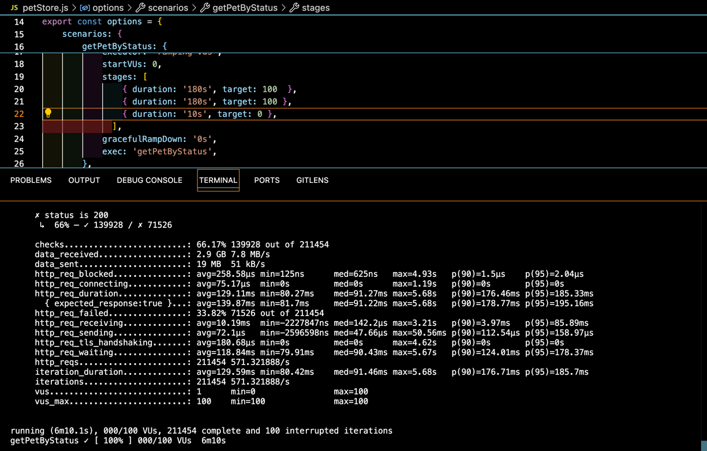

**Pet Store API Test Automation**

This project is a test automation project for the Pet Store API. 

## Getting Started

These instructions will get you a copy of the project up and running on your local machine for development and testing purposes.

### Prerequisites
run docker image of pet store api
```
docker pull swaggerapi/petstore3:unstable
docker run  --name swaggerapi-petstore3 -d -p 8080:8080 swaggerapi/petstore3:unstable
```

### Installing

1.clone the project
``` 
git clone https://github.com/alexacastrillonv/petStoreAPITestAutomation.git 
```
2.open the project in your IDE
3.run the project
4.run the tests

## Built With

* [Java](https://www.java.com/) - The programming language used
* [Gradle](https://gradle.org/) - Dependency Management
* [Cucumber](https://cucumber.io/) - Test Automation
* [Rest Assured](https://rest-assured.io/) - API Testing
* [Json Schema Validator](https://github.com/networknt/json-schema-validator) - JSON Schema Validation
* [contributors](https://github.com/alexacastrillonv/petStoreAPITestAutomation/contributors) who participated in this project.

### Explanation of the tests cases

The tests cases are divided into two groups: 
* Pet API
* User API

#### Pet API

The Pet API tests cases are divided into the following scenarios:

1. Create Pet
2. Create Pet with invalid data
3. Create a existing pet
4. Get pet by id
5. Delete pet by id
6. Pet not found

#### User API

The User API tests cases are divided into the following scenarios:

1. Create User
2. Create User with invalid data
3. Create a existing user
4. Get user by username
5. Delete user by username
6. User not 
7. User not found

# Performance Tests

run the performance tests with the following command:

```
docker build . -t dock-k6 
ocker run --rm dock-k6 run petStore.js 
```

## Analisys performance get pet by status


# Response Times (Latency): 
some requests take up to 5.68 seconds, which is too slow for high-performance applications.

# Failed Requests
* 33.82% of requests failed, which is a serious issue.
* Likely linked to long response times, meaning requests are timing out or returning errors.

# Request Rate and Load
* Requests per second: ~571
* Virtual users (vus): 100 max
The server might be struggling to handle this load, leading to high failure rates.